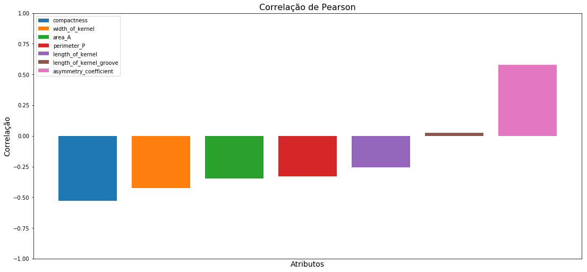
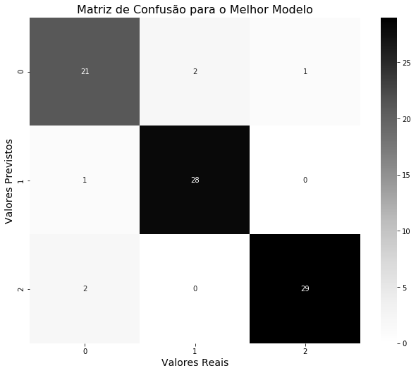

# Atividade 4 - 30/10/2018

**Apresentação da Tarefa:** 30/10/18 <br>
**Data da Entrega:** 08/11/18

### Equipe

- Luiz Eduardo Fernandes Bentes - 1415080151
- Vitor Matheus de Souza Carvalho - 1515080624

**Link para o Repositório:** https://github.com/VitorMatheus097/ANN-FourthProject

## Importação de bibliotecas e funções auxiliares


```python
import pandas as pd
import numpy as np
import os

from matplotlib import pyplot as plt
import seaborn as sns

from sklearn.metrics import confusion_matrix, accuracy_score, precision_score, recall_score, f1_score
from sklearn.model_selection import train_test_split, GridSearchCV
from sklearn.neural_network import MLPClassifier

import warnings
warnings.filterwarnings('ignore')
```


```python
def classificationReport(Y_true, Y_predicted, model, average):
    accuracy = accuracy_score(Y_true, Y_predicted)
    precision = precision_score(Y_true, Y_predicted, average=average)
    recall = recall_score(Y_true, Y_predicted, average=average)
    f1Score = f1_score(Y_true, Y_predicted, average=average)
    
    cfDict = {'Acurácia': accuracy, 
              'Precisão' : precision, 
              'Revocação' : recall, 
              'F-Score': f1Score}

    classificationDescription = pd.DataFrame(cfDict, index=[model])
    return classificationDescription
```

## Preparação dos dados


```python
path = os.path.join('data', 'seeds.csv')

data = pd.read_csv(path)
data.sample(3)
```


```html
<div>
<style scoped>
    .dataframe tbody tr th:only-of-type {
        vertical-align: middle;
    }

    .dataframe tbody tr th {
        vertical-align: top;
    }

    .dataframe thead th {
        text-align: right;
    }
</style>
<table border="1" class="dataframe">
  <thead>
    <tr style="text-align: right;">
      <th></th>
      <th>area_A</th>
      <th>perimeter_P</th>
      <th>compactness</th>
      <th>length_of_kernel</th>
      <th>width_of_kernel</th>
      <th>asymmetry_coefficient</th>
      <th>length_of_kernel_groove</th>
      <th>class</th>
    </tr>
  </thead>
  <tbody>
    <tr>
      <th>3</th>
      <td>13.84</td>
      <td>13.94</td>
      <td>0.8955</td>
      <td>5.324</td>
      <td>3.379</td>
      <td>2.259</td>
      <td>4.805</td>
      <td>1</td>
    </tr>
    <tr>
      <th>99</th>
      <td>18.72</td>
      <td>16.34</td>
      <td>0.8810</td>
      <td>6.219</td>
      <td>3.684</td>
      <td>2.188</td>
      <td>6.097</td>
      <td>2</td>
    </tr>
    <tr>
      <th>45</th>
      <td>13.80</td>
      <td>14.04</td>
      <td>0.8794</td>
      <td>5.376</td>
      <td>3.155</td>
      <td>1.560</td>
      <td>4.961</td>
      <td>1</td>
    </tr>
  </tbody>
</table>
</div>
```


```python
correlations = data[data.columns.drop(['class'])].corrwith(data['class'])
correlations.sort_values(inplace=True)

ax = plt.axes()
for x, y, label in zip(range(0, len(correlations)), correlations, correlations.keys()):
    ax.bar(x, y, label=label)

plt.title("Correlação de Pearson", fontsize=16)
plt.xlabel('Atributos', fontsize=14)
plt.ylabel('Correlação', fontsize=14)

ax.set(ylim=[-1, 1])
plt.xticks([])
plt.legend()

fig = plt.gcf()
fig.set_size_inches(18.5, 8.5)

plt.show()
```





Como observado acima, o atributo ***length_of_kernel_groove*** possui a menor correlção linear com o atributo alvo, deste modo, o mesmo foi descosiderado para a etapa de treinamento, visto que pouco refletiria no resultado final. 


```python
X, Y = data[data.columns.drop(['length_of_kernel_groove', 'class'])], data['class']
X_train, X_test, Y_train, Y_test = train_test_split(X, Y, test_size=0.4, shuffle=True)
```

## Parâmetros da rede


```python
alphas, ni, no = [0.5, 2.0, 3.0], len(X_train.columns), 3
hidden_layers = []

for alpha in alphas:
    nh = int(round(alpha * np.sqrt(ni * no)))
    
    for i in range(1, nh+1):
        if (nh - i):
            t = (ni, i, nh-i, no,)
        else:
            t = (ni, i, no,)
        
        hidden_layers.append(t)
```


```python
params = {'activation' : ['identity', 'logistic', 'tanh', 'relu'],
          'solver' : ['lbfgs'],
          'alpha' : [1e-3, 1e-5, 1e-7],
          'learning_rate' : ['adaptive'],
          'hidden_layer_sizes' : hidden_layers}
```

## Treinamento e Resultados


```python
gs = GridSearchCV(MLPClassifier(), params, cv=3, n_jobs=-1, scoring='accuracy', return_train_score=False)
gs.fit(X, Y);
```


```python
results = pd.DataFrame(gs.cv_results_).drop(['params'], axis=1)
results.sort_values('rank_test_score', inplace=True)
```


```python
best_model = gs.best_estimator_
best_model.fit(X_train, Y_train);

Y_pred = best_model.predict(X_test)
```

#### Melhores modelos


```python
results.head()
```


<div>
<style scoped>
    .dataframe tbody tr th:only-of-type {
        vertical-align: middle;
    }

    .dataframe tbody tr th {
        vertical-align: top;
    }

    .dataframe thead th {
        text-align: right;
    }
</style>
<table border="1" class="dataframe">
  <thead>
    <tr style="text-align: right;">
      <th></th>
      <th>mean_fit_time</th>
      <th>std_fit_time</th>
      <th>mean_score_time</th>
      <th>std_score_time</th>
      <th>param_activation</th>
      <th>param_alpha</th>
      <th>param_hidden_layer_sizes</th>
      <th>param_learning_rate</th>
      <th>param_solver</th>
      <th>split0_test_score</th>
      <th>split1_test_score</th>
      <th>split2_test_score</th>
      <th>mean_test_score</th>
      <th>std_test_score</th>
      <th>rank_test_score</th>
    </tr>
  </thead>
  <tbody>
    <tr>
      <th>24</th>
      <td>0.298960</td>
      <td>0.016029</td>
      <td>0.000451</td>
      <td>0.000017</td>
      <td>identity</td>
      <td>1e-05</td>
      <td>(6, 2, 3)</td>
      <td>adaptive</td>
      <td>lbfgs</td>
      <td>0.958333</td>
      <td>0.927536</td>
      <td>0.811594</td>
      <td>0.900000</td>
      <td>0.063117</td>
      <td>1</td>
    </tr>
    <tr>
      <th>248</th>
      <td>0.158502</td>
      <td>0.058239</td>
      <td>0.000486</td>
      <td>0.000004</td>
      <td>relu</td>
      <td>1e-05</td>
      <td>(6, 9, 4, 3)</td>
      <td>adaptive</td>
      <td>lbfgs</td>
      <td>0.944444</td>
      <td>0.942029</td>
      <td>0.797101</td>
      <td>0.895238</td>
      <td>0.068658</td>
      <td>2</td>
    </tr>
    <tr>
      <th>6</th>
      <td>0.107995</td>
      <td>0.004040</td>
      <td>0.000465</td>
      <td>0.000014</td>
      <td>identity</td>
      <td>0.001</td>
      <td>(6, 5, 3, 3)</td>
      <td>adaptive</td>
      <td>lbfgs</td>
      <td>0.958333</td>
      <td>0.927536</td>
      <td>0.797101</td>
      <td>0.895238</td>
      <td>0.069800</td>
      <td>2</td>
    </tr>
    <tr>
      <th>52</th>
      <td>0.187504</td>
      <td>0.017434</td>
      <td>0.000455</td>
      <td>0.000008</td>
      <td>identity</td>
      <td>1e-07</td>
      <td>(6, 5, 3, 3)</td>
      <td>adaptive</td>
      <td>lbfgs</td>
      <td>0.972222</td>
      <td>0.927536</td>
      <td>0.782609</td>
      <td>0.895238</td>
      <td>0.080887</td>
      <td>2</td>
    </tr>
    <tr>
      <th>18</th>
      <td>0.108788</td>
      <td>0.003091</td>
      <td>0.000464</td>
      <td>0.000014</td>
      <td>identity</td>
      <td>0.001</td>
      <td>(6, 9, 4, 3)</td>
      <td>adaptive</td>
      <td>lbfgs</td>
      <td>0.958333</td>
      <td>0.927536</td>
      <td>0.797101</td>
      <td>0.895238</td>
      <td>0.069800</td>
      <td>2</td>
    </tr>
  </tbody>
</table>
</div>


#### Melhor modelo


```python
results.head(1)
```


<div>
<style scoped>
    .dataframe tbody tr th:only-of-type {
        vertical-align: middle;
    }

    .dataframe tbody tr th {
        vertical-align: top;
    }

    .dataframe thead th {
        text-align: right;
    }
</style>
<table border="1" class="dataframe">
  <thead>
    <tr style="text-align: right;">
      <th></th>
      <th>mean_fit_time</th>
      <th>std_fit_time</th>
      <th>mean_score_time</th>
      <th>std_score_time</th>
      <th>param_activation</th>
      <th>param_alpha</th>
      <th>param_hidden_layer_sizes</th>
      <th>param_learning_rate</th>
      <th>param_solver</th>
      <th>split0_test_score</th>
      <th>split1_test_score</th>
      <th>split2_test_score</th>
      <th>mean_test_score</th>
      <th>std_test_score</th>
      <th>rank_test_score</th>
    </tr>
  </thead>
  <tbody>
    <tr>
      <th>24</th>
      <td>0.29896</td>
      <td>0.016029</td>
      <td>0.000451</td>
      <td>0.000017</td>
      <td>identity</td>
      <td>1e-05</td>
      <td>(6, 2, 3)</td>
      <td>adaptive</td>
      <td>lbfgs</td>
      <td>0.958333</td>
      <td>0.927536</td>
      <td>0.811594</td>
      <td>0.9</td>
      <td>0.063117</td>
      <td>1</td>
    </tr>
  </tbody>
</table>
</div>


## Métricas de Desempenho

#### Métricas


```python
results = classificationReport(Y_test, Y_pred, 'Melhor Modelo', 'macro')
results
```


<div>
<style scoped>
    .dataframe tbody tr th:only-of-type {
        vertical-align: middle;
    }

    .dataframe tbody tr th {
        vertical-align: top;
    }

    .dataframe thead th {
        text-align: right;
    }
</style>
<table border="1" class="dataframe">
  <thead>
    <tr style="text-align: right;">
      <th></th>
      <th>Acurácia</th>
      <th>Precisão</th>
      <th>Revocação</th>
      <th>F-Score</th>
    </tr>
  </thead>
  <tbody>
    <tr>
      <th>Melhor Modelo</th>
      <td>0.928571</td>
      <td>0.925</td>
      <td>0.925334</td>
      <td>0.924991</td>
    </tr>
  </tbody>
</table>
</div>


#### Matriz de Confusão


```python
sns.heatmap(confusion_matrix(Y_test, Y_pred), fmt='d', annot=True, cmap='Greys')

fig = plt.gcf()
fig.set_size_inches(10.5, 8.5)

plt.title('Matriz de Confusão para o Melhor Modelo', fontsize=16)
plt.xlabel('Valores Reais', fontsize=14);
plt.ylabel('Valores Previstos', fontsize=14);

plt.show()
```





## Conclusões

Diante dos resultados, o modelo que melhor se adequou à tarefa obteve **92.86%** de acurácia, sendo composto por 3 camadas ocultas e utilizando a função identidade como função de ativação. O solver escolhido foi o **lbfgs** visto que este é mais adequado a datasets pequenos como é o caso do dataset utilizado, o qual possui apenas 210 exemplos. Ainda a respeito do solver, este também se justifica devido às suas características de desempenho, pois leva menos tempo para convergência na etapa de treinamento, característica fundamental neste experimento, dada a quantidade de diferentes redes treinadas.
